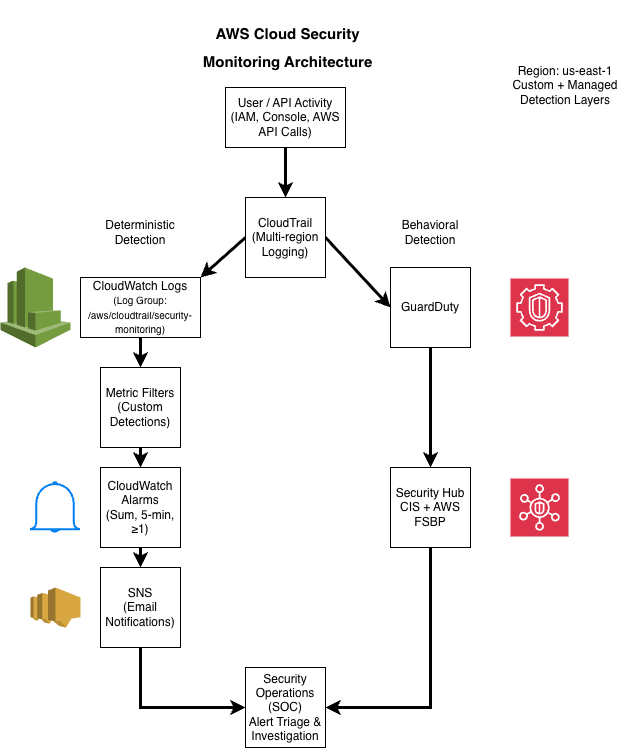

# AWS Cloud Security Monitoring Demo

## Overview
This project demonstrates the design and implementation of a cloud-native security monitoring pipeline in AWS.

The objective is to centralize logging, detect suspicious activity, trigger alerts, and document an investigation workflow — simulating real-world SOC and Cloud Security operations.

---

## Technologies Used
- AWS CloudTrail (API activity logging)
- Amazon CloudWatch Logs
- CloudWatch Metric Filters & Alarms
- Amazon SNS (Email alerting)
- Amazon GuardDuty (Threat detection)
- AWS Security Hub (Findings aggregation)

---

## Project Goals
- Establish secure IAM baseline
- Enable centralized logging
- Detect failed console login attempts
- Detect IAM privilege escalation
- Simulate security incidents
- Implement alerting pipeline
- Document investigation process

---

## Architecture Diagram

The architecture implements a layered cloud security monitoring model:

- **Telemetry Layer** – CloudTrail (multi-region management events) captures control-plane activity.
- **Custom Detection Engineering** – CloudWatch Logs + Metric Filters generate deterministic detections for IAM abuse.
- **Alerting Layer** – CloudWatch Alarms (Sum, 5-min, ≥1) trigger SNS email notifications.
- **Managed Threat Detection** – GuardDuty provides behavioral and threat-intelligence–based analysis.
- **Security Posture Layer** – Security Hub CSPM aggregates findings and evaluates CIS + AWS best practice controls.
- **Security Operations Layer** – All alerts and findings converge into a structured SOC-style investigation workflow.

---

## Detection Use Cases
(To be documented during build)

---

## Incident Simulations
(To be documented during build)

---

## Lessons Learned
(To be documented during build)

---

## Author
Usman Saiyed  
Cloud Security & Infrastructure Enthusiast
