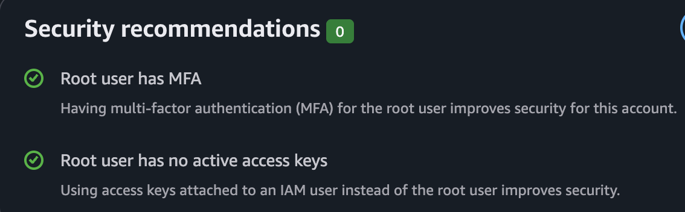
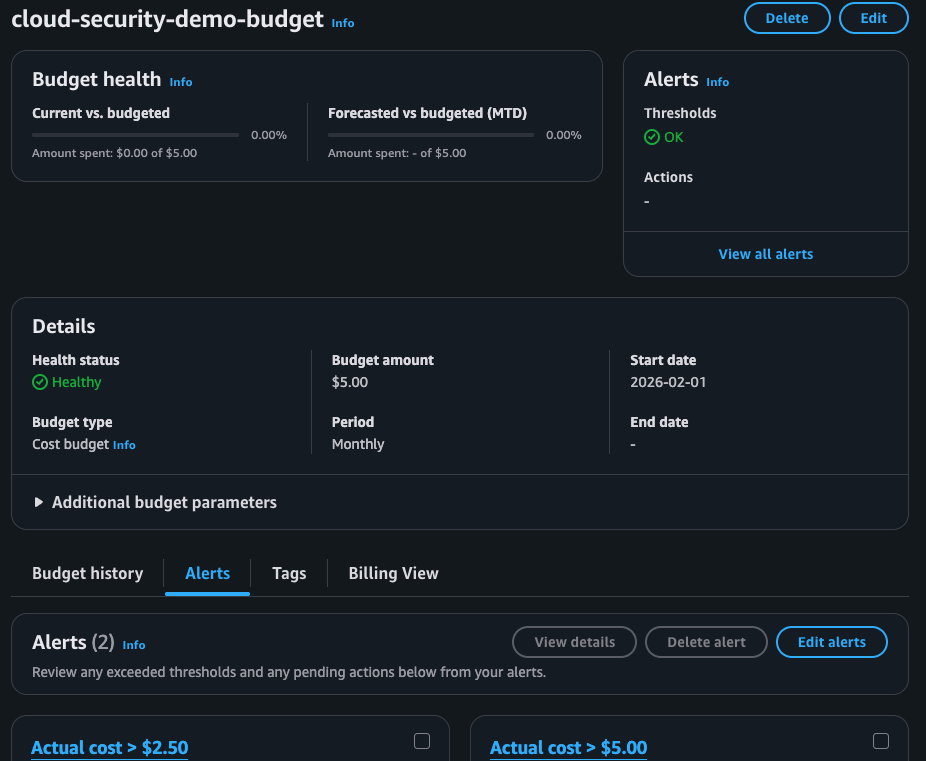

# Account Baseline

## Root Account
- MFA enabled: Yes
- Access keys present: Yes
- Notes:
### Root MFA Status

## Admin User
- Username:usmansaiyed
- MFA enabled: Yes
- Access keys present: Yes
- Attached policies:
AdministratorAccess, AWSBillingConductorFullAccess, Billing
- Notes: 

## Guardrails
- Root used only for billing/emergency: (Yes/No)
- Admin used only for setup: (Yes/No)
- Plan for least privilege demo user/role:
  - Proposed name:
  - Proposed policies:

## Evidence
- Screenshots:
  - (add filenames here)

## Cost Governance

### Budget Created
- Name: cloud-security-demo-budget
- Amount: $5/month
- Alerts: 50% and 80%

### Evidence

