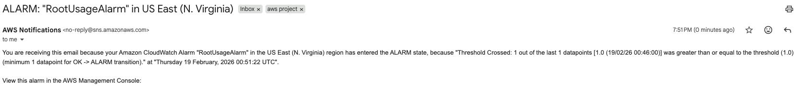

## Privilege Escalation Simulation Results

### Alarm Behavior
- Alarm transitioned to "In alarm" after attaching AdministratorAccess.
- SNS email alert received.
- Alarm returned to "OK" after no further escalation events.

### Investigation Pivot

From alarm → CloudWatch Logs:
- Located AttachUserPolicy event
- Confirmed policyArn = AdministratorAccess
- Confirmed initiating IAM principal
Evidence: 
### Alarm Triggered

### Cleanup
- Detached AdministratorAccess
- Deleted escalation-test-user

---

# Incident Simulation — Root Account Usage

## Objective

Detect successful AWS Console logins performed by the root account and trigger an immediate alert.

Root account usage is considered high-risk because:
- It has unrestricted permissions.
- It bypasses IAM policy controls.
- It is not scoped by least privilege.
- It is often targeted during credential compromise.

Monitoring root activity is a critical security control.

---

## Detection Logic

### Log Source
CloudTrail → CloudWatch Logs

### Event Criteria
- eventName = ConsoleLogin
- userIdentity.type = Root
- responseElements.ConsoleLogin = Success

### Metric Filter Pattern

{ $.eventName = "ConsoleLogin" && $.userIdentity.type = "Root" && $.responseElements.ConsoleLogin = "Success" }

### Metric Configuration
- Namespace: SecurityMetrics
- Metric Name: RootConsoleLogin
- Metric Value: 1

---

## Alarm Configuration

- Alarm Name: RootUsageAlarm
- Statistic: Sum
- Period: 5 minutes
- Threshold: ≥ 1
- Evaluation Periods: 1
- SNS Topic: security-alerts

This configuration ensures that any successful root login within a 5-minute window triggers an alert.

---

## Test Procedure

1. Logged out of AWS completely.
2. Logged in using the root account credentials.
3. Waited for CloudTrail event ingestion.
4. Verified alarm transitioned to "In alarm".
5. Confirmed SNS email notification received.
6. Logged out of root account immediately after testing.

---

## Observed Behavior

- Alarm transitioned from "Insufficient data" → "In alarm".
- Email alert was received via SNS.
- After a clean 5-minute evaluation window with no additional root activity, the alarm returned to "OK".

---

## Investigation Pivot

From the alarm:
1. Navigated to CloudWatch Alarm details.
2. Opened associated metric graph.
3. Pivoted to CloudWatch Logs.
4. Located ConsoleLogin event.
5. Confirmed:
   - userIdentity.type = Root
   - ConsoleLogin = Success
   - eventTime and source context

Evidence:
### Metric Set

### Alarm Triggered

---

## Security Significance

Root account monitoring is a foundational cloud security best practice.

In production environments, root usage often triggers:
- Immediate SOC investigation
- Credential rotation
- Incident response escalation

This detection demonstrates high-severity monitoring capability within AWS-native tooling.
